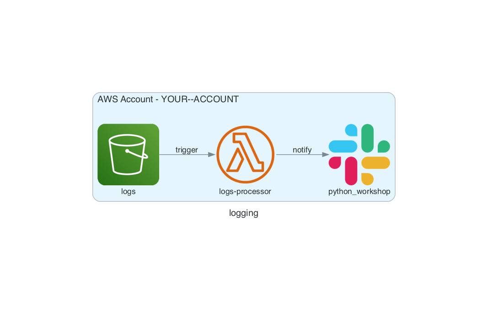

## Story 6: S3 Logs Processor to notify on new object in the bucket  

### Objectives:
- Create s3 bucket
- Create FaaS (AWS Lambda) to notify whenever a new key gets created in a s3 bucket.
- Deploy FaaS in an automated way.
- Object-Oriented, type followed, test coverage

### Steps:
