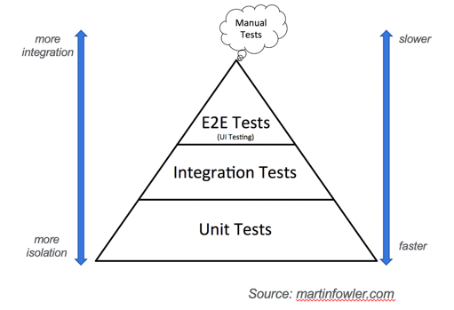

# Python Best Practices
## Agenda
- Managing Multiple Python Versions
- Follow style guidelines.
- Use the PyPI Instead of Doing it Yourself
> Katas
- Structure of the Python Project ([kata-1](./doc/kata-1/HOW-TO.md))
- Explicitly declare and isolate dependencies ([kata-2](./doc/kata-2/HOW-TO.md))
- Define types in python ([kata-3](./doc/kata-3/HOW-TO.md))
- Write Object-Oriented Code ([kata-3](./doc/kata-3/HOW-TO.md))
- Follow Single Responsibility (functions too) ([kata-4](./doc/kata-4/HOW-TO.md))
- Write Tests ([kata-4](./doc/kata-4/HOW-TO.md))
- Debugging ([kata-4](./doc/kata-4/HOW-TO.md))
- Boto3 ([kata-5](./doc/kata-5/HOW-TO.md))
- TDD (Test-Driven-Development) ([kata-6](./doc/kata-6/HOW-TO.md))

---

### Managing Multiple Python Versions
- OS Python really belongs to the operating system. After all, it came installed with the operating system.
- You are installing globally when you do `sudo pip install` on system python.
- Package managers (yum, apt, brew etc) install their packages into the global system space.
- Once again, you still don’t have control over what version of Python you can install. If you want to support and test on Python 3.4 - 3.7.
- What would happen on your system when you type python3?
- You can eliminate all these by using [pyenv](https://github.com/pyenv/pyenv). 
- pyenv is a wonderful tool for managing multiple Python versions.
- Same advantages as tfswitch or tfenv but its more important using pyenv due to more complexity around python packages.
> https://github.com/pyenv/pyenv

---

### Follow style guidelines
- The PEP8 holds some great community-generated proposals.
- **PEP** stands for **Python Enhancement Proposals** - these are guidelines and standards for development. 
  This is to make sure all Python code looks and feels the same.
- Few guidelines to go over:
  - Use proper naming conventions for variables, functions, methods, and more.
  - Variables, functions, methods, packages, modules: this_is_a_variable
  - Classes and exceptions: CapWords
  - Protected methods and internal functions: _single_leading_underscore
  - Private methods: __double_leading_underscore
  - Constants: CAPS_WITH_UNDERSCORES
  - Use 4 spaces for indentation. _Convent spaces to tabs_
  - Use an IDE (Pycharm, VSCode etc.) which can enforce these standards.
  - For more conventions, refer to [PEP8](https://www.python.org/dev/peps/pep-0008/).
> https://www.python.org/dev/peps/pep-0008/

---

### Use the PyPI Instead of Doing it Yourself
- One of the reasons behind Python’s popularity is the [PyPI](https://pypi.org/) - this is the Python Package Index; it has more than 319,515 
  projects (_at the time of writing this presentation_).
- You should use code from this instead of writing it yourself - this saves time and lets you focus on the more important 
  things.
- Install these using pip. You can also create and upload your own packages here.
- You can envision this same as using ansible galaxy collections (e.g. `ansible-galaxy collection install amazon.aws`) 
or terraform modules (CE, community etc.). 
- Do not reinvent the wheel. :point_left:
> https://pypi.org/

---
#### Complete [Kata-1](doc/kata-1/HOW-TO.md) and [Kata-2](doc/kata-2/HOW-TO.md) 
---
### Type Checking
- Python is a dynamically typed language. 
- Lets work with some examples.
- The opposite of dynamic typing is static typing. e.g. Java and C.
- Python will always [remain a dynamically typed language](https://www.python.org/dev/peps/pep-0484/#non-goals). 
- However, [PEP 484](https://www.python.org/dev/peps/pep-0484/) introduced type hints, which make it possible to also do static type checking of Python code.
type hints.
- type hints has no runtime effect: they are only hints and are not enforced on their own.
- You need use a static type checker (a tool). You might already have a built in IDE like PyCharm.
- Most common tool for doing type checking is [Mypy](http://mypy-lang.org/). 
- There are more out there like pyright (microsoft), pyre (facebook) etc.

---
#### Complete [Kata-3](doc/kata-3/HOW-TO.md) 
---

### Write Object-Oriented Code
- A procedural program is typically a list of instructions that execute one after the other starting from the top of the line.
- On the other hand, object-oriented programs are built around well objects. You can think about objects as something that exists in the real world.
- Object-oriented programming enables you to develop large, modular programs that can instantly expand over time.
- You should use the object-oriented paradigm if writing code for Python.
- This has the advantages of data hiding and modularity. It allows reusability,  polymorphism, data encapsulation, and inheritance
- Objects can have state which can help greatly.
- Let’s take an example, say, you have a requirement implementing logging.(_Please note that this is just one of the 
  many benefits when moving to OOP with Python._)
- You create python module say `my_logger.py`.
```python
import logging


def get_logger():
    print("calling logging.getLogger() each time")
    logger = logging.getLogger()
```
- If you execute
```shell
    for x in range(5):
        my_logger.get_logger()

### Output
calling logging.getLogger() each time
calling logging.getLogger() each time
calling logging.getLogger() each time
calling logging.getLogger() each time
calling logging.getLogger() each time
```
- You create another python module say `my_logger_class.py`
```python
import logging


class MyLogger:
    # Class variables

    # Constructor method with instance variables name and age
    def __init__(self):
        self.my_log = None

    def get_logger(self):
        if self.my_log is None:
            print("calling logging.getLogger() each time")
            self.my_log = logging.getLogger()
        return self.my_log
```
- If you execute
```shell
    my_log = MyLogger()
    for x in range(5):
        my_log.get_logger()

### Output
calling logging.getLogger() each time
```
- :point_right: Since object have state, you can save call to actual python logger and can thus improve performance.

---
#### Complete [Kata-4](doc/kata-4/HOW-TO.md) 
---

### Testing, or why it should be called Self-Testing code
- Self-Testing code is a practice of writing comprehensive automated tests.
- Single command that executes the tests.
- You have self-testing code when you can run a series of automated tests against the code base and be confident that, 
  should the tests pass, your code is free of any substantial defects.
- Self-testing code is a key part of **Continuous Integration**.
- It can drastically reduce the number of bugs that get into production.
- Important behaviour of a team that practices self-testing code is the reaction to a production bug. 
  The usual reaction of a team using self-testing code is to first write a test that exposes the bug, and only then 
  to try to fix it.
- Many many many more reasons … …

#### The Test Pyramid

- **Unit tests** - a __unit__ will most likely be a single function. In an object-oriented language a unit can range 
  from a single method to an entire class. Mocking and Stubbing.
- **Integration Tests** – as the name suggests, they test the integration of your application with all the parts that 
  live outside of your application.
- The more the merrier.
- At the end of the day, writing automated tests is what's important.

---
#### Complete [Kata-5](doc/kata-5/HOW-TO.md) 
---

### Boto3
- Both, AWS CLI and boto3 are built on top of botocore - a low-level Python library that takes care of everything needed to send an API request to AWS and receive a response back.
- Botocore: handles session, credentials, and configuration, takes care of serializing input parameters, signing requests, and deserializing response data into Python dictionaries
- You can think of botocore as a package that allows us to forget about underlying JSON specifications and use Python (boto3) when interacting with AWS APIs.
- What happens when you call boto3.client()? Let’s look at the code:

```python
def client(*args, **kwargs):
  """
  Create a low-level service client by name using the default session.

  See :py:meth:`boto3.session.Session.client`.
  """
  return _get_default_session().client(*args, **kwargs)


...
...
...


def _get_default_session():
  """
  Get the default session, creating one if needed.

  :rtype: :py:class:`~boto3.session.Session`
  :return: The default session
  """
  if DEFAULT_SESSION is None:
    setup_default_session()

  return DEFAULT_SESSION


...
..
....
def setup_default_session(**kwargs):
    """
    Set up a default session, passing through any parameters to the session
    constructor. There is no need to call this unless you wish to pass custom
    parameters, because a default session will be created for you.
    """
    global DEFAULT_SESSION
    DEFAULT_SESSION = Session(**kwargs)
```
- _get_default_session() is a caching function for the field boto3.DEFAULT_SESSION , which is an object of the type boto3.Session.
- The boto3.Session class stores configuration state and allows you to create service clients and resources.
- Most importantly it represents the configuration of an IAM identity (IAM user or assumed role) and AWS region, the two things you need to talk to an AWS service.
- **If you’ve got credentials and need to talk to two regions? Use two sessions.**
- **Same region, but different credentials? Different sessions**

#### Boto3 - Clients vs. Resources
- In most cases, we should use boto3 rather than botocore. Using boto3, we can choose to either interact with lower-level clients or higher-level object-oriented resource abstractions.
- To understand the difference between those components, let’s look at a simple example that will demonstrate the difference between an S3 client and an S3 resource.
- If you check now, rather than acting on the `response["Contents"]` when using the low-level client, you are now accessing  operations or methods on the object.
- With a low-level client, you directly interact with response dictionary from a deserialized API response.
- In contrast, with the resource, you interact with standard Python classes and objects rather than raw response dictionaries.
- Overall, the resource abstraction results in a more readable code

#### Boto3 – Session: How to pass IAM credentials to your boto3 code?
1. Explicitly pass to boto3.client(), boto3.resource() or boto3.Session().
2. Set as environment variables.
3. Set as credentials in the ~/.aws/credentials file.
4. Use the aws profile name set while setting up the session.

#### Boto3 - Waiters
- Waiters are polling the status of a specific resource until it reaches a state that you are interested in.
- For instance, when you create an EC2 instance using boto3, you may want to wait till it reaches a “Running” state until you can do something with this EC2 instance or if you have would like the code to wait until the bucket exists.
```python
# S3: Wait for a bucket to exist.
bucket.wait_until_exists()

# EC2: Wait for an instance to reach the running state.
instance.wait_until_running()
```

---
#### Complete [Kata-6](doc/kata-6/HOW-TO.md) 
---

### References
- https://boto3.amazonaws.com/v1/documentation/api/latest/index.html